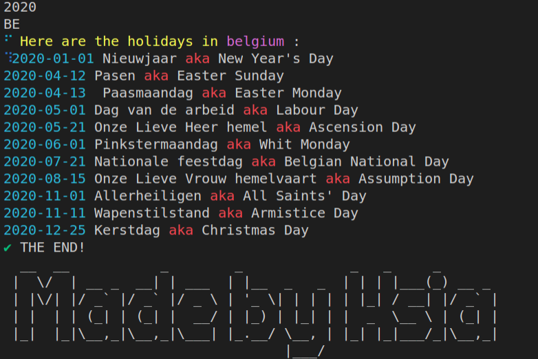

# js-cli
## Intro
It's a small project from Becode Liege in April 2021, to practice my npm cli skill.
After downloading this package, you can get all the holidays from the year and country you choose.

## How to install it?
`npm i @yunhsiaho/js-cli`
Easy, right?

## How to use it
Type this command with the year and country you want
`holidays [year] [country]`
For example:
`holidays 2020 belgium`

## Want to see some result?
Voila~

## Used packages
- [country-list](https://www.npmjs.com/package/country-list) 
- [axios](https://www.npmjs.com/package/axios) 
- [ora](https://www.npmjs.com/package/ora)
- [chalk](https://www.npmjs.com/package/chalk)
- [figlet](https://www.npmjs.com/package/figlet) 

## License
#### ISC

## Keyword
none